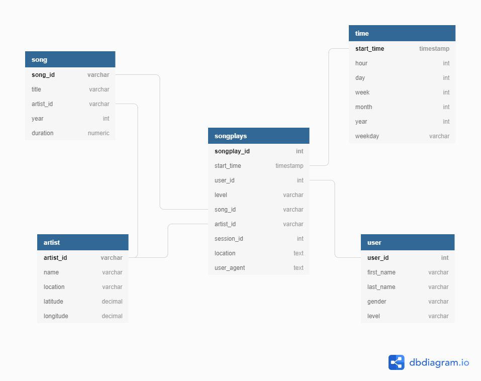

# Project: Data Modeling with Postgres

The Data Modeling with Postgres is the first of six assignments required in Udacity's Data Engineering Nanodegree.

### Introduction
A startup called Sparkify wants to analyze the data they've been collecting on songs and user activity on their new music streaming app. The analytics team is particularly interested in understanding what songs users are listening to. Currently, they don't have an easy way to query their data, which resides in a directory of JSON logs on user activity on the app, as well as a directory with JSON metadata on the songs in their app.

They'd like a data engineer to create a Postgres database with tables designed to optimize queries on song play analysis and bring you on the project. Your role is to create a database schema and ETL pipeline for this analysis. You'll be able to test your database and ETL pipeline by running queries given to you by the analytics team from Sparkify and compare your results with their expected results.

### Project Description

The project has three main goals:
1. (Dimensional model) Star-schema structure creation - The creation and implementation of a pre-defined star-schema according to the specifications
2. JSON data processing - Reading and processing a set of JSON files representing user interactions and a song database
3. Dimensional model feeding - Using the processed files to populate the constructed dimensional model

**Note**: The project is self-contained and automatically handles exceptions. If an error is found for a given parsed file, the whole insertion is rolled back, regardless of the correctness of previous inserts of the same file instance (e.g. users, songs, artists, time and songplays are rolled back).

### Data Model

The required data model is a star-schema comprised by one fact table, songplays, which records the songs played by users, along with four dimensions, users, songs, artists and finally, time.

Notice how the song dimension is actually dependent on the artist dimension. In a typical star-schema, this would not be allowed, resembling instead a snowflake model. However, this relation is merely set to enforce data quality, not to create a snowflake model.

| Table| Type| Dependencies | Description |
|---|---|---| --- | 
|   songplays| Fact| song, artist, user, time| Records in log data associated with song plays |
|   song|   Dimension| artist  | Represents an artist's song |
|   artist|   Dimension| none  | Represents a given artist |
|   user|   Dimension | none | Represents a platform user |
|   time|   Dimension | none | The time dimension |
 

#### Fact Table
#####  songplays
 
| Column| Type| Constraints|
|---|---|---|
|   songplay_id| SERIAL|  Primary Key| 
|   start_time|   bigint| Foreign Key time(start_time)| 
|   user_id|   int|   Foreign Key users(user_id) | 
|   level|   varchar || 
|   song_id|   varchar| Foreign Key songs(song_id)| 
|   artist_id|   varchar|Foreign Key artists(artist_id)| 
|   session_id|   int|| 
|   location|   text|| 
|   user_agent|   text|| 
 

* Insertion query 
        INSERT INTO songplays (start_time, user_id, level, song_id, artist_id, session_id, location, user_agent) 
            VALUES(%s, %s, %s, %s, %s, %s, %s, %s)
#### Dimension Tables

#### user

| Column| Type| Constraints|
|---|---|---|
|   user_id| serial | Primary Key| 
|   first_name|   varchar|| 
|   last_name|   varchar|| 
|   gender|   varchar(1) || 
|   level|   varchar|| 
 

* Insertion query 
        INSERT INTO users (user_id, first_name, last_name, gender, level) \
            VALUES(%s, %s, %s, %s, %s)
            ON CONFLICT(user_id) 
                DO UPDATE
                    SET level = EXCLUDED.level;

#### songs

 | Column| Type| Constraints|
|---|---|---|
|   song_id| varchar|  Primary Key | 
|   title|   varchar|| 
|   artist_id|   varchar|| 
|   year|   int || 
|   duratio	|   numeric	|| 
  

* Insertion query
        INSERT INTO songs(song_id, title, artist_id, year, duration)
            VALUES (%s,%s,%s,%s,%s)
            ON CONFLICT(song_id) 
                DO NOTHING;
                
#### artists
 | Column| Type| Constraints|
|---|---|---|
|   artist_id| varchar| Primary Key| 
|   name|   varchar|| 
|   location|   text|| 
|   latitude|   decimal|| 
|   longitude|   decimal || 

  
* Insertion query
        INSERT INTO artists(artist_id, name, location, latitude, longitude)
            VALUES (%s,%s,%s,%s,%s) 
            ON CONFLICT(artist_id) 
                DO NOTHING;

#### time

 | Column| Type| Constraints|
|---|---|---|
|   start_time| bigint| Primary Key| 
|   hour|   int|| 
|   day|   int|| 
|   week|   int|| 
|   month|   int|| 
|   year|   int|| 
|   weekday|   varchar|| 

 
* Insertion query 
        INSERT INTO time(start_time, hour, day, week, month, year, weekday)
            VALUES (%s,%s,%s,%s,%s,%s,%s) 
            ON CONFLICT(start_time) 
                DO NOTHING;
            
### Project Structure

The project is comprised of three key files:
- **sql_queries.py** - Contains SQL query definition, from table creation to data insertion and analysis
- **create_tables.py** - Executes the queries required to setup the database and the model's tables
- **etl.py** - Processes the log and song files and inserts data into the PostgreSQL database

#### The ETL process (etl.py)

The ETL process is divided into four main steps:

1. Establish a database connection
2. Process the **song** JSON objects
    1. Extract and populate the **song** dimension
    2. Extract and populate the **artist** dimension
3. Process the **log** JSON objects
    1. Populate the **time** dimension
    2. Populate the **user** dimension
    3. Populate the **songplay** fact table
        1. Note: This is a composite operation, given the insertion requires fetching the Arist and Song IDs associated with the given song and artist name, in addition to the song's duration
4. Close the database connection

### Running the Project
In order to run the project, two files need to be called:
1. (Single run) **create_tables.py** to generate the required tables
2. **etl.py** to retrieve existing data and populate the dimensional model

Note: If additional data is inserted, the **etl.py** file can be ran with no data duplication concerns, given the queries are built to prevent data redundancy.